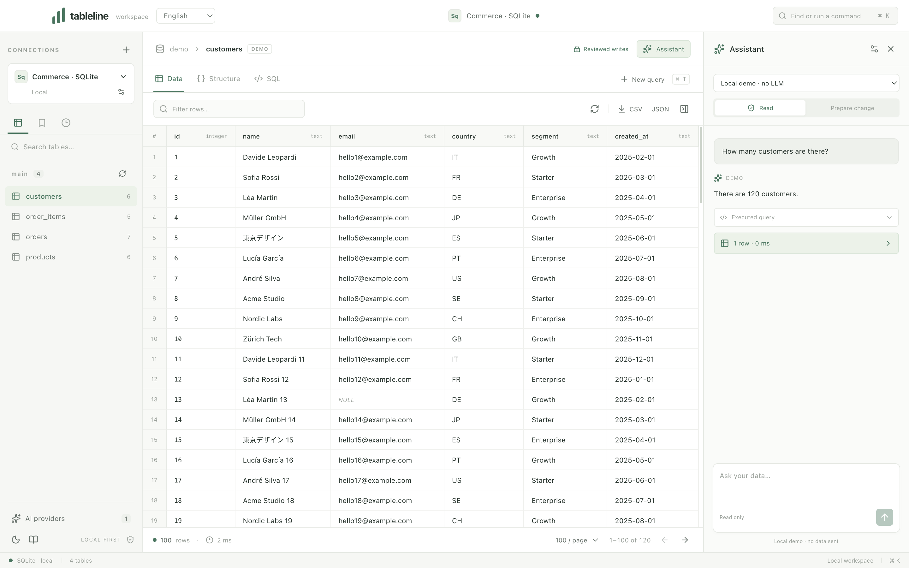

# Tableline

A local desktop workspace for databases and grounded AI. Browse tables, run queries, keep SQL drafts, and review every write before applying it.

[Italiano](README.it.md) · [Releases](https://github.com/Hexecu/tableline/releases/tag/v0.2.0) · [Contributing](CONTRIBUTING.md) · [Privacy](docs/PRIVACY.md) · [Security](SECURITY.md)




## Try it

Download the historical application and checksum from [GitHub Releases](https://github.com/Hexecu/tableline/releases/tag/v0.2.0). That MIT release targets macOS on Apple Silicon. Current GPL source targets **macOS Intel/Apple Silicon, Linux x64/arm64 and Windows x64/arm64**, with native package/runtime checks in [the platform matrix](docs/PLATFORMS.md). New cross-platform installers have not been published.

Open **Local demo** to use a real SQLite database with 120 customers, 36 products, 1,000 orders and 1,000 order items. Its assistant is explicitly labeled as a deterministic demo and needs no LLM account. Switch the interface between **English, Italian, French, German and Spanish** in the language selector; the choice persists across restarts. Database names, SQL, model output and server diagnostics retain their original content.

## Workspace

- Browse, filter, sort and paginate tables; inspect columns, keys, row values and JSON.
- Use SQL tabs with completion, saved queries, history and restored drafts. Export the current page or result as CSV or JSON.
- Search commands and tables with **⌘ K**, open a query with **⌘ T**, run it with **⌘ Enter**, save with **⌘ S**, and open the assistant with **⌘ I**.
- Edit SQL cells with a primary key, or prepare INSERT, UPDATE and DELETE statements. Review the proposal and confirm its single-use token to apply it.
- Choose a persistent light or dark theme. Draft restoration has bounded storage; save important queries explicitly.

## Connections

| Database family | Profiles | Write support |
| --- | --- | --- |
| SQLite | SQLite | Reviewed writes with a rolled-back preview |
| PostgreSQL | PostgreSQL, Aurora PostgreSQL, CockroachDB | Reviewed transactional writes |
| MySQL | MySQL, MariaDB, Aurora MySQL | Reviewed transactional writes; InnoDB required |
| SQL Server | SQL Server | Reviewed transactional writes |
| Analytics | Databricks SQL, Redshift, ClickHouse | Read-only |
| Document / key-value | MongoDB, Redis | Reviewed allowlisted JSON operations; no shared rollback |

Adapters use real client libraries. Aurora profiles use their engine's protocol. The catalog exposes each adapter's capabilities; it does not imply live cloud certification. Local fixture checks cover SQLite, PostgreSQL, MySQL, MongoDB, Redis and ClickHouse. Live Databricks/Aurora/Redshift accounts, CockroachDB, MariaDB and SQL Server need separate acceptance tests. See [database capabilities](docs/DATABASES.md) and [validation](docs/VALIDATION.md).

New connections start read-only. TLS verifies remote certificates when enabled. Database principals remain the server-side authority. SSH tunnels, database IAM/OAuth, Oracle, Snowflake, BigQuery, Cassandra, DuckDB, Elasticsearch, DDL, backup/restore and bulk import are not implemented in this release.

## Assistant

Configure **OpenAI, Anthropic, Azure OpenAI, Google AI Studio, Vertex AI, Amazon Bedrock, LiteLLM, Ollama** or an **OpenAI-compatible endpoint**. The selected model ID and destination remain visible. Provider discovery and tests use your configured endpoint; no cloud account is required for the database client.

An explicit question can send bounded schema, question history and up to four bounded query results to that provider. Answers expose successful query evidence; schema-only replies are marked separately. **Prepare change** requires an explicit mutation request and returns a proposal; the assistant has no commit tool. Human confirmation uses the same database write-review flow. Model answers still need review. See [the assistant contract](docs/AI.md) and [data handling](docs/PRIVACY.md).

Secrets are stored separately from profile metadata and encrypted through Electron safeStorage. Unavailable secure storage, including Linux's `basic_text` backend, is rejected without a plaintext fallback. Native credential requests are serialized; a timeout blocks further requests until restart. Separate Linux/Windows CI acceptance exercises real OS encryption with disposable synthetic credentials. macOS authorization remains a supervised installed-app check; see [the storage boundary](docs/PLATFORMS.md#credential-storage).

## Develop

Use **Node.js 22.13 or newer** and npm. CI uses Node 22 and 24.

```sh
git clone https://github.com/Hexecu/tableline.git
cd tableline
npm ci
npm run dev
```

```sh
npm test
npm run test:i18n
npm run build
node scripts/e2e-locales.cjs
npm run package
```

Locale desktop checks run an isolated Electron app and guard native credential APIs against invocation. Linux requires a display, for example `xvfb-run -a node scripts/e2e-locales.cjs`. `npm run test:e2e` runs the broader database/provider desktop suite; it deliberately exits nonzero while native credential acceptance is excluded. It is not the CI locale-smoke command. `TABLELINE_E2E_CREDENTIALS=1` opts into a supervised credential test that may show an OS authorization dialog.

For optional disposable server checks:

```sh
TABLELINE_DB_INTEGRATION=1 node --test tests/database-integration.test.cjs
docker compose -f fixtures/compose.yaml up -d
node scripts/integration-extras.cjs
node scripts/e2e-fixtures.cjs
docker compose -f fixtures/compose.yaml down -v
```

These commands create synthetic data in dedicated fixtures bound to loopback. `down -v` removes those fixture volumes. Never point seed scripts at your own databases.

`npm run package` creates a local app directory; `TABLELINE_RELEASE_DIR` selects its output. Signing, notarization, archive verification and publishing are distinct steps described in [the release procedure](docs/PUBLIC_RELEASE.md). There is no auto-updater, telemetry or hosted Tableline service. Operational limits and recovery are documented in [SERVICE.md](docs/SERVICE.md).

## License

Tableline's original source, documentation and assets are licensed under the [GNU General Public License, version 3 only](LICENSE) (`GPL-3.0-only`). See [COPYRIGHT](COPYRIGHT) for the copyright, warranty and source-availability notice. Contributions use the same license. Distributed modified versions must provide their Corresponding Source under GPLv3; private use and commercial use are allowed.

The GPL transition starts with the source revision introducing this notice. Earlier versions, including v0.2.0, remain under their original MIT terms; their tags and release artifacts are unchanged. Third-party components retain their own licenses. Tableline adapts provider integration code from an earlier MIT snapshot of [Branchline](https://github.com/Hexecu/branchline), with its original copyright and complete MIT notice preserved in [third-party notices](THIRD_PARTY_NOTICES.md). TablePlus is an independent product and is not affiliated with Tableline.
